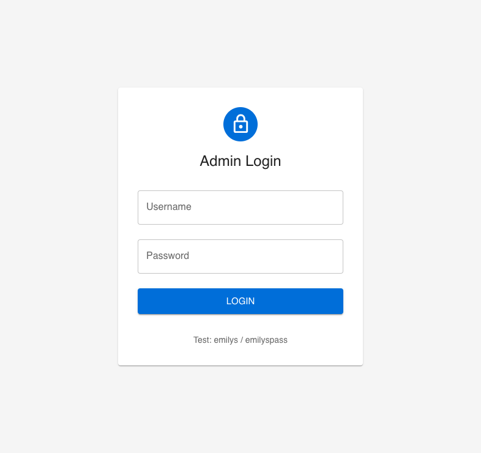
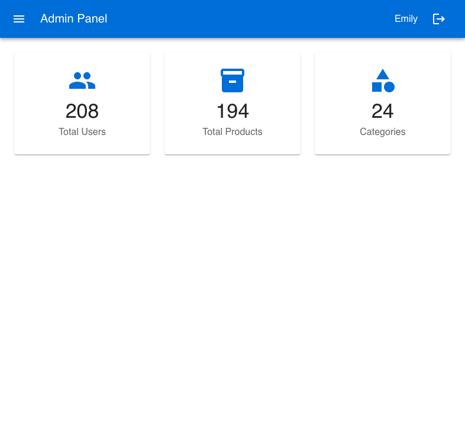
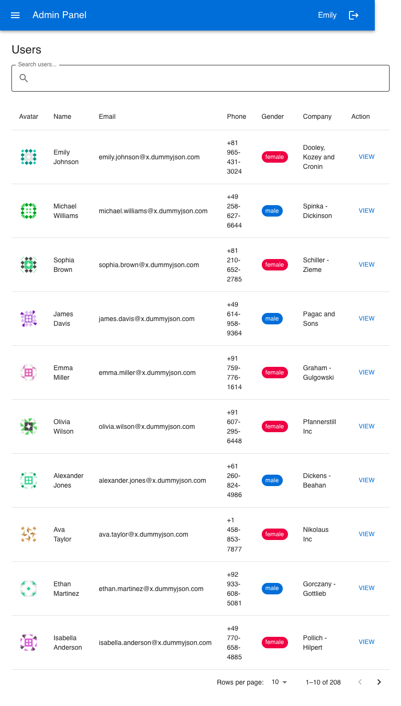
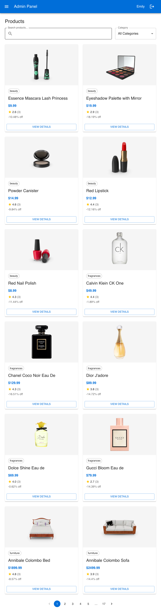

# Help Study Abroad - Frontend Assessment

Admin dashboard application built for a frontend internship assessment.


## Features
- Login with DummyJSON credentials and token persistence
- Protected routes with redirect to login for unauthenticated users
- Dashboard summary cards for users, products, and categories
- Users module with search, pagination, and profile detail pages
- Products module with search, category filter, pagination, and detail pages
- Zustand domain stores for auth, users, and products
- Axios API abstraction with request interceptor support
- Responsive Material UI layout for desktop and mobile

## Tech Stack
- Next.js 14 (Pages Router)
- React 18
- Material UI (MUI)
- Zustand
- Axios

## Screenshots
### Login


### Dashboard


### Users


### Products


## Test Credentials
- Username: emilys
- Password: emilyspass

## Environment Variables
Create a .env.local file from .env.local.example:

NEXT_PUBLIC_API_URL=https://dummyjson.com

## Run Locally
Using npm:
1. npm install
2. npm run dev

Using bun:
1. bun install
2. bun run dev

Open http://localhost:3000 (or the next available port printed in the terminal).

## Production Build
- npm run build
- bun run build

## Folder Structure
help-study-abroad/
- components/
  - Layout.jsx
  - Loader.jsx
  - ProductCard.jsx
  - ProtectedRoute.jsx
  - UserTable.jsx
- lib/
  - api.js
- pages/
  - _app.js
  - index.js
  - login.js
  - dashboard/index.js
  - users/index.js
  - users/[id].js
  - products/index.js
  - products/[id].js
- store/
  - authStore.js
  - userStore.js
  - productStore.js
- styles/
  - globals.css
- theme/
  - index.js

## Architecture Notes
- Domain-first state separation with independent stores
- Reusable layout and UI components across pages
- Centralized API client for consistent request behavior
- Token stored in state and synchronized with localStorage

## Trade-Offs
- Data lists are client-rendered to keep implementation straightforward
- In-memory caching favors speed during navigation over persistence
- Zustand chosen over Redux to reduce boilerplate for this project size

## What I Would Improve Next
- Add unit tests for stores and key reusable components
- Add end-to-end tests for auth and protected-route flows
- Add richer empty and error states with skeleton loaders
- Add table sorting controls for users and products
````markdown


